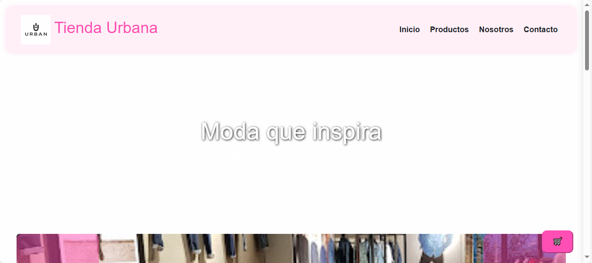
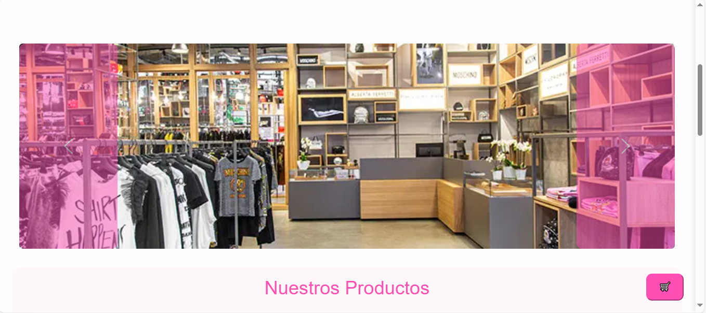
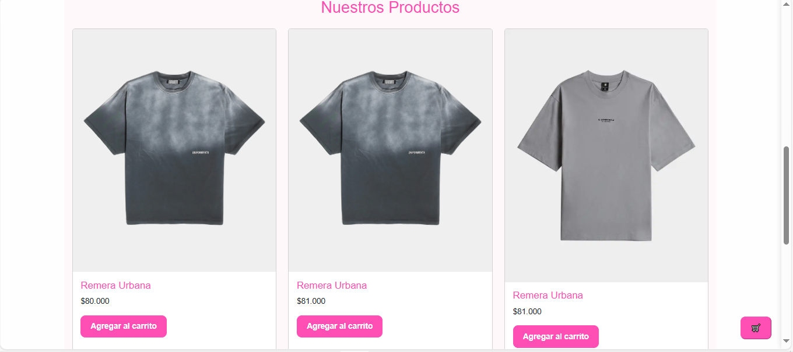
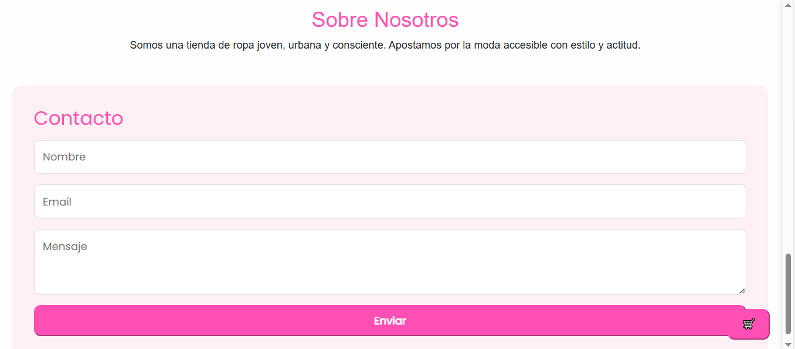
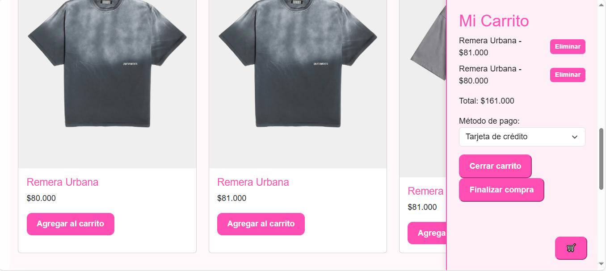
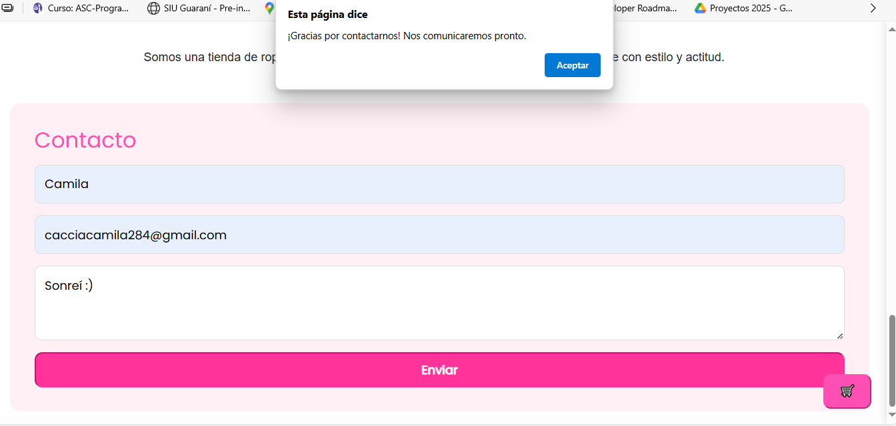

# Tienda Urbana

Tienda Urbana es una tienda online de ropa joven, urbana y consciente que ofrece una experiencia de compra sencilla y atractiva. Está desarrollada con HTML, CSS y JavaScript, usando Bootstrap para el diseño responsivo.

---

## Descripción

Este proyecto es un sitio web de e-commerce básico con funcionalidades como:

- Navegación por secciones: Inicio, Productos, Nosotros, Contacto.
- Carrusel de banners.
- Listado de productos con botón para agregar al carrito.
- Carrito lateral con listado dinámico, total y métodos de pago.
- Formulario de contacto con alerta de envío.
- Diseño responsivo con Bootstrap y estilos personalizados.

---

## Tecnologías utilizadas

- HTML5
- CSS3 (con fuente Poppins y estilos personalizados)
- JavaScript (para la funcionalidad del carrito y formulario)
- Bootstrap 5.3 (CSS y JS)
  
---

## Cómo usarlo

1. Clonar o descargar el repositorio.
2. Abrir el archivo `index.html` en un navegador moderno.
3. Navegar por las secciones, agregar productos al carrito y probar la funcionalidad.
4. Completar el formulario de contacto para probar el envío (muestra alerta).

---

## Estructura del proyecto

## Capturas de pantalla

  
  
  
  
  

---

## Autor

Camila Caccia

---

## Contacto

Para consultas o sugerencias, usar el formulario de contacto en la página.

---

¡Gracias por visitar Tienda Urbana!
